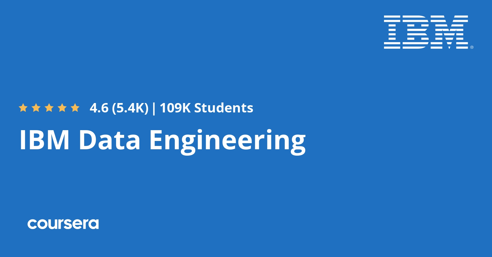
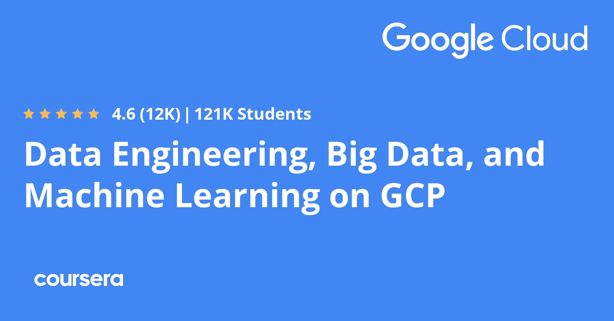

  

 

  <a href="https://www.coursera.org/">Coursera</a> is a learning platform for many topics and interests, such as Data Engineering.
  This repository is to showcases all the courses and modules I completed in Coursera related to Data Engineering.

 

# Learn

 

## IBM Data Engineering Professional Certificate [[🔍](https://www.coursera.org/professional-certificates/ibm-data-engineer)]

- [[🔍](https://www.coursera.org/learn/introduction-to-data-engineering?specialization=ibm-data-engineer)] [[📃](https://www.coursera.org/account/accomplishments/verify/EYGUDP9SWKTK)] Introduction to Data Engineering

- [[🔍](https://www.coursera.org/learn/introduction-to-relational-databases?specialization=ibm-data-engineer)] [[📃](https://www.coursera.org/account/accomplishments/verify/RPFAP452NQ5P)] Introduction to Relational Databases (RDBMS)

- [[🔍](https://www.coursera.org/learn/sql-data-science?specialization=ibm-data-engineer)] [[📃](https://www.coursera.org/account/accomplishments/verify/D82FRH78AV6Q)] Databases and SQL for Data Science with Python

- [[🔍](https://www.coursera.org/learn/hands-on-introduction-to-linux-commands-and-shell-scripting?specialization=ibm-data-engineer)] [[📃](https://www.coursera.org/account/accomplishments/verify/CZKJZJEWLPY2)] Hands-on Introduction to Linux Commands and Shell Scripting

- [[🔍](https://www.coursera.org/learn/relational-database-administration?specialization=ibm-data-engineer)] [[📃](https://www.coursera.org/account/accomplishments/verify/DJ5W2RWFJ2EN)] Relational Database Administration (DBA)

- [[🔍](https://www.coursera.org/learn/etl-and-data-pipelines-shell-airflow-kafka?specialization=ibm-data-engineer)] [[📃](https://www.coursera.org/account/accomplishments/verify/DTDS5S56IC2I)] ETL and Data Pipelines with Shell, Airflow and Kafka

- [[🔍](https://www.coursera.org/learn/data-warehouse-fundamentals?specialization=ibm-data-engineer)] [[📃](https://www.coursera.org/account/accomplishments/verify/REU30OVIO64U)] Data Warehouse Fundamentals

- [[🔍](https://www.coursera.org/learn/bi-dashboards-with-ibm-cognos-analytics-and-google-looker?specialization=ibm-data-engineer)] [[📃](https://www.coursera.org/account/accomplishments/verify/M1CFXZXO22L2)] BI Dashboards with IBM Cognos Analytics and Google Looker

- [[🔍](https://www.coursera.org/learn/introduction-to-nosql-databases?specialization=ibm-data-engineer)] [[📃](https://www.coursera.org/account/accomplishments/verify/7947Z66H0TSA)] Introduction to NoSQL Databases

- [[🔍](https://www.coursera.org/learn/introduction-to-big-data-with-spark-hadoop?specialization=ibm-data-engineer)] [[📃](https://www.coursera.org/account/accomplishments/verify/QN79QUBVWHFN)] Introduction to Big Data with Spark and Hadoop

- [[🔍](https://www.coursera.org/learn/machine-learning-with-apache-spark?specialization=ibm-data-engineer)] [[📃](https://www.coursera.org/account/accomplishments/verify/IO0YFJWXIWJT)] Machine Learning with Apache Spark

- [[🔍](https://www.coursera.org/learn/data-enginering-capstone-project?specialization=ibm-data-engineer)] [[📃](https://www.coursera.org/account/accomplishments/verify/2INGLQBRVQSP)] Data Engineering Capstone Project

- [[🔍](https://www.coursera.org/learn/generative-ai-elevate-your-data-engineering-career?specialization=ibm-data-engineer)] [[📃](https://www.coursera.org/account/accomplishments/verify/GIUBJUNQLHS4)] Generative AI: Elevate your Data Engineering Career

- [[🔍](https://www.coursera.org/learn/data-engineering-career-guide-and-interview-preparation?specialization=ibm-data-engineer)] [[📃](https://www.coursera.org/account/accomplishments/verify/F068BFCKQV6F)] Data Engineering Career Guide and Interview Preparation

 

 

## Data Engineering, Big Data, and Machine Learning on GCP Specialization [[🔍](https://www.coursera.org/specializations/gcp-data-machine-learning)]

- [[🔍](https://www.coursera.org/learn/gcp-big-data-ml-fundamentals?specialization=gcp-data-machine-learning)] [[📃](https://www.coursera.org/account/accomplishments/verify/DQC2N74SQKXG)] Google Cloud Big Data and Machine Learning Fundamentals

- [[🔍](https://www.coursera.org/learn/data-lakes-data-warehouses-gcp?specialization=gcp-data-machine-learning)] [[📃](https://www.coursera.org/account/accomplishments/verify/D6DAUERC2XC8)] Modernizing Data Lakes and Data Warehouses with Google Cloud

- [[🔍](https://www.coursera.org/learn/batch-data-pipelines-gcp?specialization=gcp-data-machine-learning)] [[📃](https://www.coursera.org/account/accomplishments/verify/7EWCQJTBYPAH)] Building Batch Data Pipelines on Google Cloud